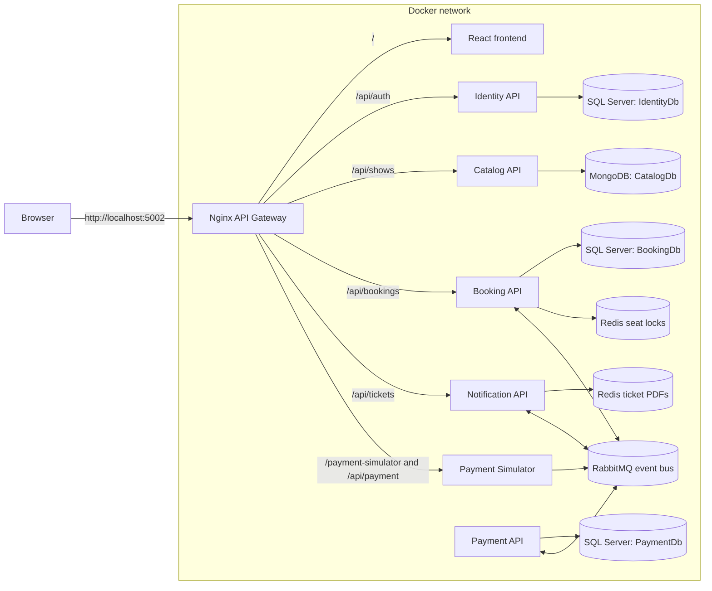
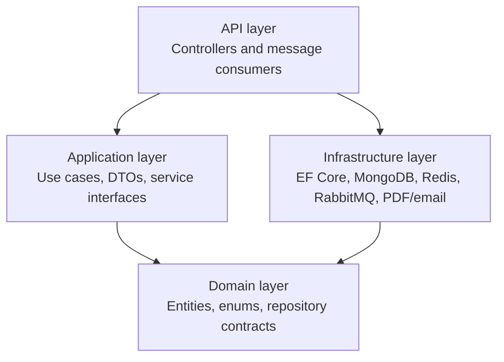
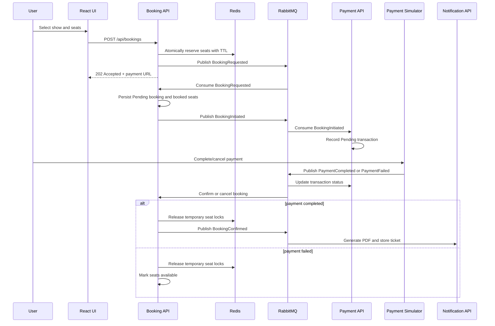
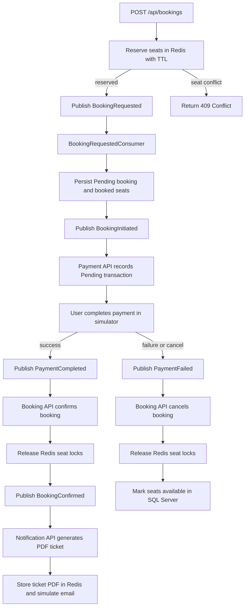

# TicketSwift - Event-Driven Ticket Booking Platform

TicketSwift is a full-stack ticket booking system built as a set of independently owned .NET microservices with a React frontend. The project demonstrates service-oriented architecture, event-driven workflows, domain-oriented layering, distributed seat locking, API gateway routing, containerized infrastructure, and practical local development automation.

The system supports show discovery, user registration/login, seat reservation, asynchronous booking processing, simulated payment completion/failure, PDF ticket generation, and ticket retrieval.

## Table of Contents

- [Architecture Overview](#architecture-overview)
- [Core Capabilities](#core-capabilities)
- [System Components](#system-components)
- [Booking Flow](#booking-flow)
- [Architecture and Design Patterns](#architecture-and-design-patterns)
- [Technology Stack](#technology-stack)
- [Repository Structure](#repository-structure)
- [Ports and Routing](#ports-and-routing)
- [Getting Started](#getting-started)
- [Running Locally](#running-locally)
- [Running with Docker](#running-with-docker)
- [API Surface](#api-surface)
- [Data and Messaging](#data-and-messaging)
- [Reliability and Operational Practices](#reliability-and-operational-practices)
- [Frontend Architecture](#frontend-architecture)
- [Load Testing Seat Contention](#load-testing-seat-contention)
- [Configuration](#configuration)
- [Engineering Best Practices Used](#engineering-best-practices-used)
- [Future Improvements](#future-improvements)

## Architecture Overview



In Docker mode, only Nginx is exposed to the host. The frontend, APIs, payment simulator, databases, Redis, and RabbitMQ stay inside the Docker network. The application uses synchronous HTTP for user-facing queries and commands, while long-running booking/payment/ticket operations are coordinated through RabbitMQ events using MassTransit.

### Service Layering

Each microservice follows the same high-level shape so business behavior stays out of controllers and infrastructure details stay behind interfaces.



## Core Capabilities

- User registration and login with JWT token generation.
- Movie/show catalog search and CRUD operations.
- Seat reservation with Redis-backed short-lived distributed locks.
- Asynchronous booking persistence and payment processing.
- Payment simulator for success, failure, and cancellation flows.
- Booking confirmation and cancellation based on payment outcome.
- PDF ticket generation with QuestPDF.
- Ticket storage and retrieval through Redis.
- Dockerized full-stack deployment with Nginx reverse proxy.
- Infrastructure-only development mode for local debugging.

## System Components

| Component | Responsibility | Storage / Dependency |
| --- | --- | --- |
| `Identity.API` | Registers users, authenticates credentials, issues JWTs | SQL Server |
| `Catalog.API` | Manages and searches shows | MongoDB |
| `Booking.API` | Reserves seats, creates bookings, tracks booking status | SQL Server, Redis, RabbitMQ |
| `Payment.API` | Records pending transactions and updates payment result | SQL Server, RabbitMQ |
| `PaymentSimulator.API` | Browser-based payment simulation and event publishing | RabbitMQ |
| `Notification.API` | Generates/stores PDF tickets and simulates email sending | Redis, RabbitMQ |
| `ticketbooking-ui` | React user interface for browsing, booking, auth, and admin flows | HTTP APIs |
| `nginx` | Routes frontend/API traffic in Docker mode | Service discovery inside Docker network |

## Booking Flow



### Event Choreography



## Architecture and Design Patterns

### Microservices

Each business capability is split into a separate service: Identity, Catalog, Booking, Payment, Notification, and Payment Simulator. Each service owns its application boundary and runtime configuration.

### Domain-Oriented Layering

Most services follow a consistent layered structure:

- `*.API`: HTTP endpoints, MassTransit consumers, composition root, middleware, health checks.
- `*.Application`: use cases, DTOs, application service interfaces.
- `*.Domain`: entities, enums, repository contracts, domain service contracts.
- `*.Infrastructure`: persistence, external services, message bus adapters.

This keeps controllers thin and moves business behavior into application services.

### Repository Pattern

Persistence is hidden behind interfaces such as:

- `IBookingRepository`
- `IShowRepository`
- `IUserRepository`
- `ITransactionRepository`
- `ITicketRepository`

The application layer depends on abstractions, while infrastructure provides EF Core, MongoDB, and Redis implementations.

### Event-Driven Choreography

Services communicate with integration events through RabbitMQ and MassTransit. Shared event contracts live in `src/Shared/TicketBooking.Common/Events`.

Main events:

- `BookingRequested`
- `BookingInitiated`
- `PaymentCompleted`
- `PaymentFailed`
- `BookingConfirmed`

The workflow is choreographed by consumers reacting to events instead of a single central orchestrator.

### API Gateway / Reverse Proxy

`nginx.conf` routes external requests to internal services:

- `/api/auth` -> Identity API
- `/api/shows` -> Catalog API
- `/api/bookings` -> Booking API
- `/api/tickets` -> Notification API
- payment simulator routes -> Payment Simulator API

This gives the frontend a stable entry point in Docker mode.

### Distributed Seat Locking

The booking service uses Redis to reserve selected seats before the booking is persisted. The implementation uses a Lua script to atomically reserve all selected seats or roll back the partial reservation. Locks expire after a short TTL, reducing double-booking risk under concurrent traffic.

### Database per Service

Services use storage that fits their domain:

- Identity: SQL Server for user records.
- Booking: SQL Server for booking and seat state.
- Payment: SQL Server for transaction state.
- Catalog: MongoDB for show documents.
- Notification: Redis for temporary generated ticket storage.

### Dependency Injection

Each API registers application services, repository implementations, infrastructure services, and message consumers in `Program.cs`. This keeps dependencies explicit and replaceable.

### Health Checks

Several services expose `/health` endpoints with JSON health output for dependencies such as SQL Server, MongoDB, Redis, and RabbitMQ.

## Technology Stack

### Backend

- .NET 10
- ASP.NET Core Web API
- Entity Framework Core with SQL Server
- MongoDB .NET Driver
- Redis via StackExchange.Redis
- RabbitMQ with MassTransit
- JWT Bearer authentication
- BCrypt password hashing
- QuestPDF ticket generation
- Swashbuckle/OpenAPI

### Frontend

- React 19
- TypeScript
- Vite
- React Router
- Bootstrap / React Bootstrap
- Lucide React icons

### Infrastructure

- Docker and Docker Compose
- Nginx reverse proxy
- SQL Server 2022 container
- MongoDB container
- Redis container
- RabbitMQ management container

## Repository Structure

```text
.
|-- src
|   |-- Booking
|   |   |-- Booking.API
|   |   |-- Booking.Application
|   |   |-- Booking.Domain
|   |   `-- Booking.Infrastructure
|   |-- Catalog
|   |-- Identity
|   |-- Notification
|   |-- Payment
|   |-- PaymentSimulator
|   `-- Shared
|       `-- TicketBooking.Common
|-- ticketbooking-ui
|-- docker-compose.yml
|-- docker-compose.infra.yml
|-- nginx.conf
|-- run-local.cmd
|-- run-ui.cmd
|-- load-test.js
`-- TicketBooking.slnx
```

## Ports and Routing

### Docker mode

| Service | External URL |
| --- | --- |
| Nginx gateway, frontend, and APIs | `http://localhost:5002` |

In full Docker mode, Nginx is the only service published to the host. APIs, frontend, payment simulator, databases, Redis, and RabbitMQ stay on the internal Docker network.

Useful gateway routes:

| Route | Target |
| --- | --- |
| `/` | React frontend |
| `/api/auth` | Identity API |
| `/api/shows` | Catalog API |
| `/api/bookings` | Booking API |
| `/api/tickets` | Notification API |
| `/api/payment` | Payment simulator API |
| `/payment-simulator/` | Payment simulator UI |
| `/health/identity` | Identity health |
| `/health/catalog` | Catalog health |
| `/health/booking` | Booking health |
| `/health/payment` | Payment health |
| `/health/notification` | Notification health |
| `/health/payment-simulator` | Payment simulator health |

### Local development mode

`run-local.cmd` starts APIs on:

| Service | URL |
| --- | --- |
| Identity API | `http://localhost:7000` |
| Catalog API | `http://localhost:7001` |
| Booking API | `http://localhost:7002` |
| Payment API | `http://localhost:7003` |
| Notification API | `http://localhost:7004` |
| Payment Simulator | `http://localhost:7005` |
| Vite UI | `http://localhost:5173` |

## Getting Started

### Prerequisites

- .NET 10 SDK
- Node.js and npm
- Docker Desktop
- Git

### Clone and restore

```bash
git clone <repository-url>
cd ticketbooking
dotnet restore TicketBooking.slnx
cd ticketbooking-ui
npm install
```

## Running Locally

The easiest local workflow on Windows is:

```bat
run-local.cmd
```

This script:

1. Starts SQL Server, MongoDB, Redis, and RabbitMQ with `docker-compose.infra.yml`.
2. Builds the .NET solution.
3. Starts each API in its own terminal window.
4. Waits for API health checks.
5. Starts the Vite frontend.
6. Opens the UI at `http://localhost:5173`.

To stop the API windows launched by the script, type `Q` in the script terminal and press Enter.

### Run infrastructure only

```bash
docker-compose -f docker-compose.infra.yml up -d
```

Then run individual APIs from your IDE or with `dotnet run`.

### Run frontend only

```bash
cd ticketbooking-ui
npm run dev
```

## Running with Docker

To run the complete stack:

```bash
docker-compose up -d --build
```

Open:

```text
http://localhost:5002
```

In Docker mode, the frontend, APIs, and payment simulator are all routed through Nginx on port `5002`. No individual microservice or infrastructure port is published to the host by `docker-compose.yml`.

To stop the stack:

```bash
docker-compose down
```

To remove persisted volumes as well:

```bash
docker-compose down -v
```

## API Surface

### Identity

| Method | Endpoint | Description |
| --- | --- | --- |
| `POST` | `/api/auth/register` | Register a user |
| `POST` | `/api/auth/login` | Login and receive JWT/user details |

### Catalog

| Method | Endpoint | Description |
| --- | --- | --- |
| `GET` | `/api/shows/search?time=<date>` | Search shows, optionally by time window |
| `GET` | `/api/shows/{id}` | Get show by ID |
| `POST` | `/api/shows` | Create show |
| `PUT` | `/api/shows/{id}` | Update show |
| `DELETE` | `/api/shows/{id}` | Delete show |

### Booking

| Method | Endpoint | Description |
| --- | --- | --- |
| `POST` | `/api/bookings` | Reserve seats and start booking workflow |
| `GET` | `/api/bookings/{id}` | Get booking details |
| `GET` | `/api/bookings/{id}/status` | Poll booking status |
| `GET` | `/api/bookings/shows/{showId}/seats` | Get booked seats for a show |
| `GET` | `/api/bookings/user/{email}` | Get bookings by user email |

### Notification

| Method | Endpoint | Description |
| --- | --- | --- |
| `GET` | `/api/tickets/{bookingId}` | Download generated ticket PDF |
| `HEAD` | `/api/tickets/{bookingId}` | Check ticket availability |

### Payment Simulator

| Method | Endpoint | Description |
| --- | --- | --- |
| `GET` | `/index.html?bookingId=...` | Payment simulator UI |
| `POST` | `/api/payment/complete` | Publish payment success/failure event |
| `GET` | `/ping` | Simulator liveness check |

## Data and Messaging

### SQL Server

SQL Server stores relational state for:

- Users in `IdentityDb`.
- Bookings and seats in `BookingDb`.
- Payment transactions in `PaymentDb`.

The booking database enforces a unique index on `(ShowId, SeatNumber)` to protect against duplicate seat records.

### MongoDB

Catalog data is stored as show documents in `CatalogDb`. The catalog service seeds initial movie shows if the collection is empty.

### Redis

Redis is used for:

- Temporary seat reservation locks in the booking workflow.
- Temporary PDF ticket storage in the notification workflow.

### RabbitMQ

RabbitMQ carries integration events. Consumers use service-specific queue names where needed so multiple services can observe the same event without competing for a single message.

## Reliability and Operational Practices

- Startup retry loops are used for database initialization while containers become ready.
- Docker health checks are configured for SQL Server, MongoDB, Redis, and RabbitMQ.
- API health endpoints expose dependency status as JSON.
- Booking persistence failures release Redis seat locks before rethrowing to MassTransit.
- Redis seat locking uses all-or-nothing Lua script behavior.
- Payment result handling updates both booking and payment projections through events.
- Environment variables override local app settings for containerized deployments.
- Nginx centralizes CORS and API routing in Docker mode.

## Frontend Architecture

The frontend lives in `ticketbooking-ui` and uses:

- Route-based pages with `react-router-dom`.
- `config.ts` to choose local debug API ports or Docker gateway routing.
- React Bootstrap for layout and controls.
- Local storage for current user session details.
- Separate pages for home/search, login, register, booking, booking result, admin, and user bookings.

Key scripts:

```bash
npm run dev
npm run build
npm run lint
npm run preview
```

## Load Testing Seat Contention

`load-test.js` sends concurrent booking attempts for the same seats to validate the Redis lock and conflict behavior.

Before running, replace `SHOW_ID` with a real show ID:

```bash
node load-test.js
```

Expected behavior under contention is that only one request reserves the selected seats and the rest receive conflict responses.

## Configuration

Common environment variables:

| Variable | Purpose |
| --- | --- |
| `DB_CONNECTION` | SQL Server connection string for Identity, Booking, or Payment |
| `MONGO_CONNECTION` | MongoDB connection string for Catalog |
| `REDIS_HOST` | Redis host and port |
| `RABBITMQ_HOST` | RabbitMQ host |
| `RABBITMQ_PORT` | RabbitMQ port |
| `RABBITMQ_USER` | RabbitMQ username |
| `RABBITMQ_PASS` | RabbitMQ password |
| `JWT_SECRET` | JWT signing secret |
| `DISABLE_CORS` | Used by Docker/Nginx flow to avoid duplicate CORS behavior |
| `PaymentSimulatorUrl` | URL used by Booking API to create payment redirect |
| `UIBaseUrl` | URL used by Booking API after simulator completion |

The checked-in compose files use development defaults. Production deployments should provide secrets through a secure secret manager or environment-specific configuration.

## Engineering Best Practices Used

- Clear service boundaries around business capabilities.
- Domain/application/infrastructure separation.
- Thin controllers delegating to application services.
- Repository abstractions for persistence.
- DTOs and integration events for explicit contracts.
- Asynchronous messaging for cross-service workflows.
- Database-per-service ownership.
- Distributed locking for high-contention booking scenarios.
- Health checks for runtime dependencies.
- Dockerized infrastructure for repeatable local environments.
- Reverse proxy routing instead of hardcoding every service endpoint into production UI calls.
- Password hashing with BCrypt.
- JWT-based identity token generation.
- OpenAPI/Swagger support for APIs.
- Retry-on-startup behavior for container dependency readiness.
- Environment-based configuration for local and Docker modes.

## Future Improvements

- Add automated unit and integration tests for service workflows.
- Add EF Core migrations instead of `EnsureCreated` for schema evolution.
- Add idempotency handling for repeated event delivery.
- Add transactional outbox/inbox patterns for stronger messaging guarantees.
- Add centralized logging and distributed tracing.
- Add structured validation for API request DTOs.
- Move development secrets out of compose files for production use.
- Add authorization policies to protected API routes.
- Add CI checks for build, lint, test, and Docker image creation.
